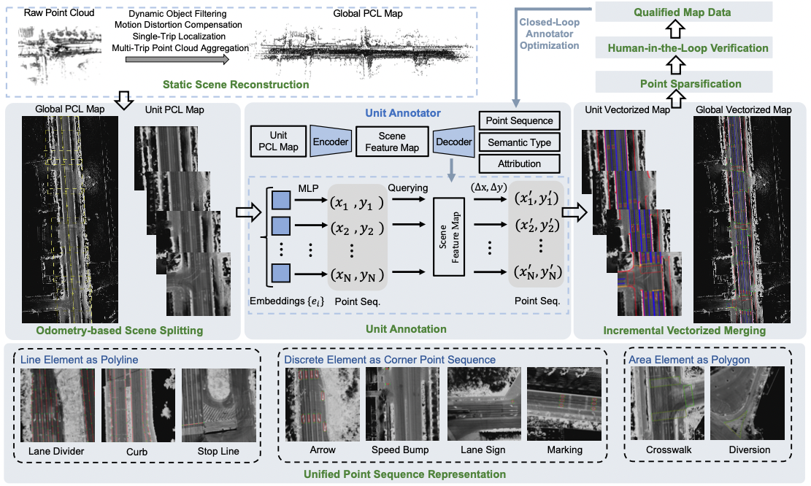
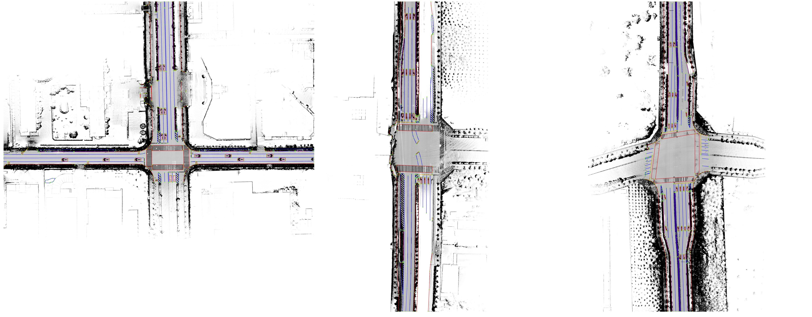
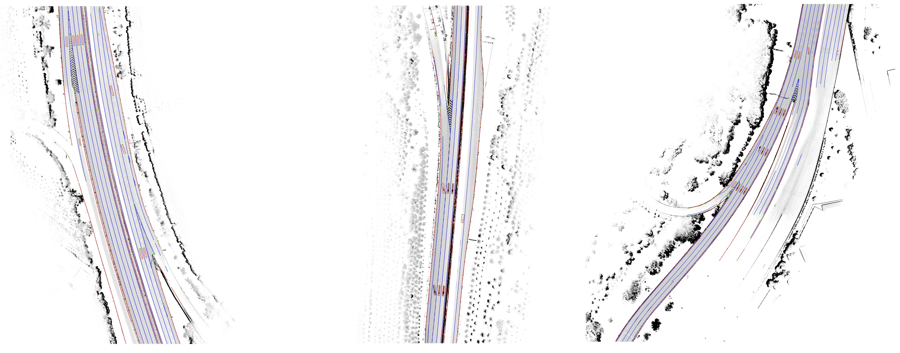

<div align="center">
<h3>VMA: Divide-and-Conquer Vectorized Map Annotation
System for Large-Scale Driving Scene</h3>

ArXiv Preprint ([arXiv 2304.09807](https://arxiv.org/pdf/2304.09807.pdf))
</div>


### News
* **`Aug. 30th, 2023`:** We release an initial version of VMA.
* **`Aug. 9th, 2023`:** Code will be released in around 3 weeks.





https://github.com/hustvl/VMA/assets/40697001/ec099b41-835a-409d-a007-9766c414a483


**TL;DR** VMA is a general map auto annotation framework based on MapTR, with high flexibility in terms of spatial scale and element type.

## Getting Started
- [Installation](docs/install.md)
- [Prepare Dataset](docs/prepare_dataset.md)
- [Inference on SD data](demo/README.md)    (we only provide some samples of SD data for inference, since SD data is owned by Horizon)
- [Train and Eval on NYC data](docs/train_eval.md)

## Auto Annotation Results
Remote sensing:

Urban scene:

Highway scene:


## Citation
If you find VMA is useful in your research or applications, please consider giving us a star 🌟 and citing it by the following BibTeX entry.
```bibtex
@inproceedings{VMA,
  title={VMA: Divide-and-Conquer Vectorized Map Annotation System for Large-Scale Driving Scene},
  author={Chen, Shaoyu and Zhang, Yunchi and Liao, Bencheng, Xie, Jiafeng and Cheng, Tianheng and Sui, Wei and Zhang, Qian and Liu, Wenyu and Huang, Chang and Wang, Xinggang},
  booktitle={arXiv preprint arXiv:2304.09807},
  year={2023}
}
```
