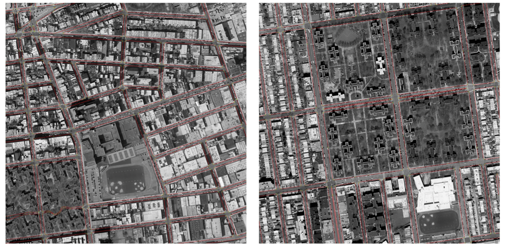
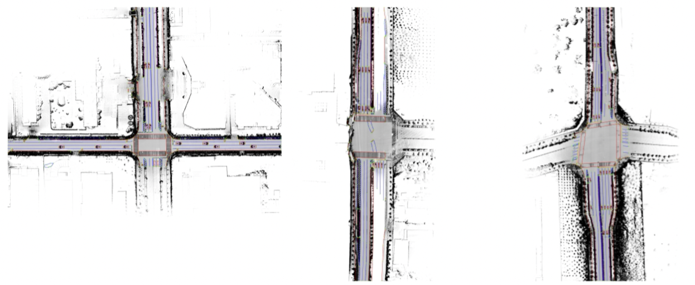
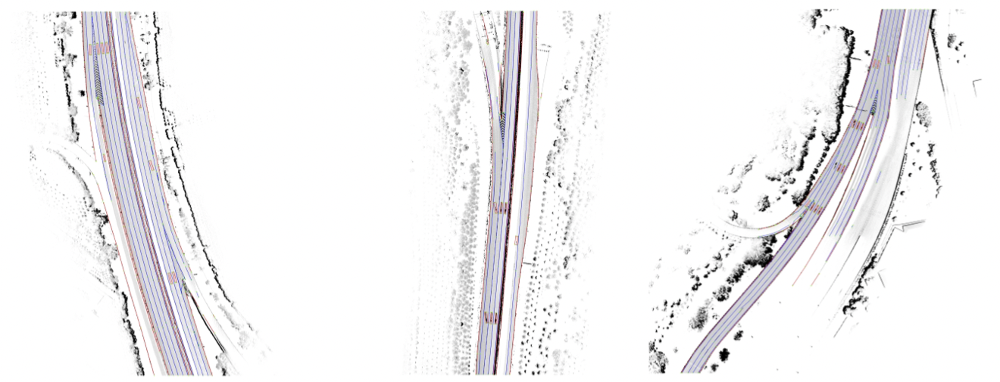

<div align="center">
<h3>VMA: Divide-and-Conquer Vectorized Map Annotation
System for Large-Scale Driving Scene</h3>

ArXiv Preprint ([arXiv 2304.09807](https://arxiv.org/pdf/2304.09807.pdf))
</div>


### News
* **`Aug. 9th, 2023`:** Code will be released in around 3 weeks.


**TL;DR** VMA is a general map auto annotation framework based on MapTR, with high flexibility in terms of spatial scale and element type.


## Auto Annotation Results
Remote sensing:

Urban scene:

Highway scene:



```bibtex
@inproceedings{VMA,
  title={VMA: Divide-and-Conquer Vectorized Map Annotation
System for Large-Scale Driving Scene},
  author={Chen, Shaoyu and Zhang, Yunchi and Liao, Bencheng, Xie, Jiafeng and Cheng, Tianheng and Sui, Wei and Zhang, Qian and Liu, Wenyu and Huang, Chang and Wang, Xinggang},
  booktitle={arXiv preprint arXiv:2304.09807},
  year={2023}
}
```